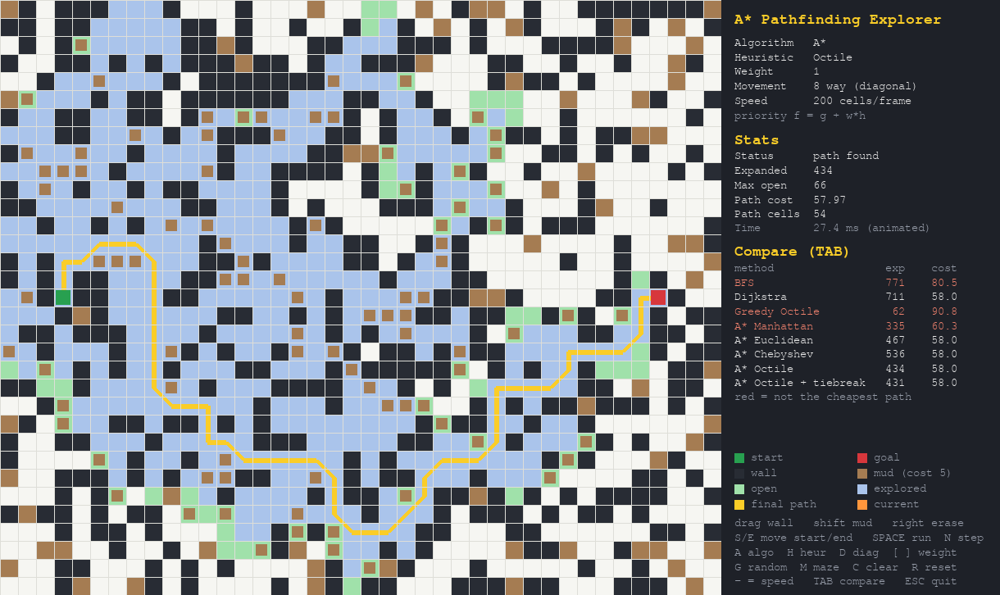

# Project 1: A* Pathfinding Exploration

ADV Machine Learning and AI, Mr. Cochran

An A* pathfinding implementation written from scratch in Python, with a live PyGame visualizer and a benchmark that measures how different heuristics trade speed for accuracy. BFS, Dijkstra, and Greedy Best First Search are included for comparison.



## Quick start

```bash
pip install -r requirements.txt
python visualizer.py        # interactive visualizer
python benchmark.py         # heuristic experiment (writes results/)
python -m pytest            # 128 correctness and edge case tests
```

In PyCharm: open the folder, set the interpreter to Python 3.10 or newer, install the requirements, then right click `visualizer.py` and choose Run.

## Project layout

| File | What it does |
|---|---|
| `pathfinding/grid.py` | The world: walls, mud (cost 5), 4 way or 8 way movement, random map and maze generators |
| `pathfinding/heuristics.py` | Six heuristic functions and notes on when each one is admissible |
| `pathfinding/search.py` | One best first search loop that becomes BFS, Dijkstra, Greedy, or A* |
| `visualizer.py` | PyGame UI that animates the search in real time |
| `benchmark.py` | Runs every method on 300 random maps per movement mode |
| `tests/test_search.py` | Edge cases and optimality checks |
| `results/` | Benchmark output (`.md` and `.csv`) and a screenshot |

## How A* works

A* keeps a **frontier** (priority queue) of cells to look at next. It repeatedly takes out the cell with the lowest score

```
f(n) = g(n) + h(n)
```

* **g(n)** is the real cost of the best route found so far from the start to n
* **h(n)** is the heuristic, a guess of the cost still left from n to the goal

When the goal comes out of the queue, A* follows parent pointers back to the start to rebuild the path. If the queue empties first, no path exists.

### From BFS to Dijkstra to A*

`search.py` uses the same loop for all four algorithms. Only the priority changes:

| Algorithm | Priority | Strength | Weakness |
|---|---|---|---|
| BFS | number of steps | fewest moves; simple | ignores terrain cost, so it walks straight through mud |
| Dijkstra | g | always cheapest path | no sense of direction; spreads out in every direction |
| Greedy Best First | h | very fast | ignores cost so far; paths are often much worse |
| **A\*** | **g + h** | cheapest path **and** aimed at the goal | only as good as its heuristic |

So A* is an evolution of the earlier two: BFS plus edge costs gives Dijkstra, and Dijkstra plus a heuristic gives A*. With h = 0, A* *is* Dijkstra (the benchmark confirms both expand exactly the same number of cells).

### Admissible and consistent heuristics

* **Admissible:** h never overestimates the real remaining cost. Then A* is guaranteed to find the cheapest path.
* **Consistent:** h(n) ≤ cost(n, m) + h(m) for every neighbor m. Then A* never needs to reopen a finished cell, which is why `search.py` can skip anything already in `closed`.

The cheapest step in this grid costs 1, so distances measured in cells never overestimate. Mud only makes the real cost larger.

## Heuristic choices

| Heuristic | Formula | 4 way | 8 way (diagonal costs √2) |
|---|---|---|---|
| Zero | 0 | admissible (same as Dijkstra) | admissible |
| Manhattan | dx + dy | admissible and exact on open ground | **overestimates** a diagonal (2 vs 1.41) |
| Euclidean | √(dx² + dy²) | admissible but loose | admissible but loose |
| Chebyshev | max(dx, dy) | admissible, loosest | admissible, loose (treats diagonal as cost 1) |
| Octile | max + (√2 − 1)·min | admissible | admissible and exact on open ground |
| Octile + tiebreak | octile + 0.001 × cross product | ≈ admissible | ≈ admissible |

**Why these?** The best heuristic is the one that matches how the agent actually moves. Manhattan is the exact open ground distance for 4 way movement and octile is the exact distance for 8 way movement. The closer h is to the real cost (without going over), the fewer cells A* has to explore. Euclidean and Chebyshev are included to show what happens when a heuristic is safe but weak.

**Tiebreak heuristic (custom).** On open ground many cells share the same f value and A* explores all of them. The tiebreak version adds a tiny amount based on how far a cell is from the straight line between start and goal (a cross product), so ties go to cells on that line. The nudge is small enough that it stayed optimal on every test map. The search also breaks ties in the priority queue by preferring the cell with the smaller h.

**Weighted A\*.** Using f = g + w·h with w > 1 makes the heuristic count more. That makes it inadmissible, so A* can return a longer path, but it explores far fewer cells. The path is guaranteed to cost at most w times the optimal cost. Press `[` and `]` in the visualizer to try it.

## Results

Averages over 300 solvable random 40×33 maps per mode (28% walls, 12% mud). "Expanded" is how many cells the search processed. "Optimal" is how often the path cost matched Dijkstra. Full tables are in [`results/benchmark_results.md`](results/benchmark_results.md).

**4 way movement**

| Method | Expanded | vs Dijkstra | Optimal | Worst cost ratio |
|---|---|---|---|---|
| BFS | 791 | 102% | 1.7% | 1.84 |
| Dijkstra | 778 | 100% | 100% | 1.00 |
| A* Manhattan | **351** | **45%** | **100%** | 1.00 |
| A* Octile | 467 | 60% | 100% | 1.00 |
| A* Euclidean | 487 | 63% | 100% | 1.00 |
| A* Chebyshev | 517 | 66% | 100% | 1.00 |
| Weighted A* Manhattan w=1.5 | 191 | 25% | 61.7% | 1.14 |
| Weighted A* Manhattan w=2 | 126 | 16% | 20.7% | 1.47 |
| Greedy Manhattan | 76 | 10% | 1.0% | 2.17 |

**8 way movement**

| Method | Expanded | vs Dijkstra | Optimal | Worst cost ratio |
|---|---|---|---|---|
| BFS | 798 | 103% | 1.0% | 1.78 |
| Dijkstra | 775 | 100% | 100% | 1.00 |
| A* Manhattan | 312 | 40% | **72.0%** | 1.07 |
| A* Octile | **397** | **51%** | **100%** | 1.00 |
| A* Octile + tiebreak | 394 | 51% | 100% | 1.00 |
| A* Euclidean | 429 | 55% | 100% | 1.00 |
| A* Chebyshev | 476 | 61% | 100% | 1.00 |
| Weighted A* Octile w=1.5 | 204 | 26% | 40.0% | 1.11 |
| Weighted A* Octile w=2 | 126 | 16% | 13.0% | 1.41 |
| Greedy Octile | 65 | 8% | 0.3% | 2.33 |

### What the numbers show

1. **A heuristic that fits the movement rules wins.** Manhattan is best for 4 way movement (55% fewer cells than Dijkstra, always optimal). Octile is best among the safe choices for 8 way movement.
2. **An overestimating heuristic breaks the optimality guarantee.** With diagonals on, Manhattan looks faster (312 cells) but misses the cheapest path on 28% of maps.
3. **Tighter is better.** Chebyshev < Euclidean < Octile in how close they are to the real cost, and the number of expanded cells goes down in that order.
4. **Speed versus accuracy is a dial.** Weight 1.5 cuts the work roughly in half again with small cost increases; weight 5 and Greedy are close to 10× faster than Dijkstra but their paths can be more than twice as expensive.
5. **BFS is not optimal once terrain has costs.** It finds the fewest moves, which usually means wading through mud.
6. **The tiebreak helps only a little here** (about 1%) because 28% walls leave few long open stretches. It helps much more on an empty map, which you can see in the visualizer by pressing `C` and then running.

## Visualizer controls

| Input | Action |
|---|---|
| Left drag | draw walls |
| Shift + left drag | paint mud |
| Right drag | erase |
| `S` / `E` | move start / end to the mouse |
| `SPACE` | run or pause |
| `N` | step one expansion |
| `R` | reset search, keep the map |
| `C` | clear the map |
| `G` / `M` | random map / maze |
| `A` | cycle algorithm (A*, Dijkstra, BFS, Greedy) |
| `H` | cycle heuristic |
| `D` | toggle diagonal movement |
| `[` / `]` | heuristic weight down / up |
| `-` / `=` | animation speed |
| `TAB` | run every method on the current map and show a comparison table (red rows are not the cheapest path) |

Colors: green = open (frontier), blue = explored (closed), orange = cell being expanded, yellow line = final path, brown = mud, dark = wall.

## Edge cases handled

* Start equals goal (path of one cell, cost 0)
* Start or goal is a wall or out of bounds (no path)
* Goal completely walled in (search empties the frontier and reports no path)
* No squeezing diagonally between two walls that touch at a corner
* Duplicate queue entries after finding a cheaper route (skipped with lazy deletion)
* Mud cells are drawn on top of the explored color so the terrain stays visible

## Testing

```bash
python -m pytest -q
```

The tests check the edge cases above, check that every admissible heuristic matches Dijkstra's cost on 40 random maps in each movement mode, check that A* Manhattan never expands more cells than Dijkstra, and check that every step in a returned path is a legal move.

## Resources

* Red Blob Games, *Introduction to the A\* Algorithm* and *Heuristics* pages (cross product tie breaking idea)
* GeeksforGeeks, *A\* Search Algorithm*
* Codementor, *Basic Pathfinding Explained with Python*

## AI Use

As required by the Durham Academy Honor Code, here is how AI was used on this project.

* **Tool:** Claude (Anthropic), in the Claude desktop app
* **What it did:** helped explain A*, BFS, Dijkstra, and heuristic admissibility; helped write and organize the code in `pathfinding/`, `visualizer.py`, `benchmark.py`, and the tests; helped draft this README
* **What I did:** *(fill in: e.g. read through and ran every file, changed X, tested the visualizer on my own maps, chose which heuristics to compare, interpreted the results)*
* **Why:** to learn how A* works by building a complete, testable version and then experimenting with it
* Each source file also has an AI use note in its header comment
